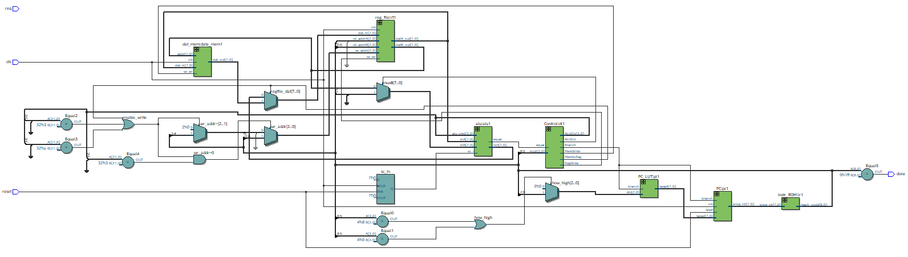
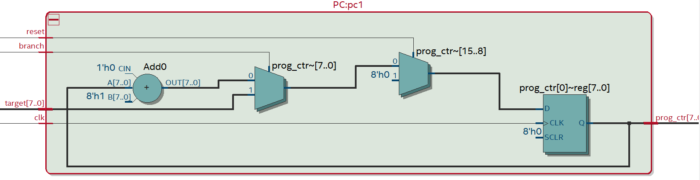
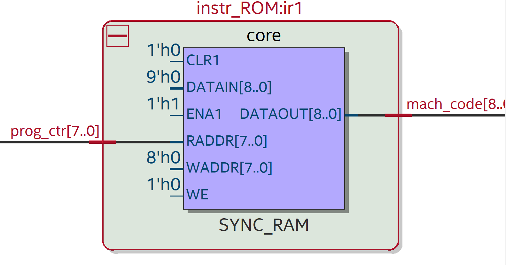
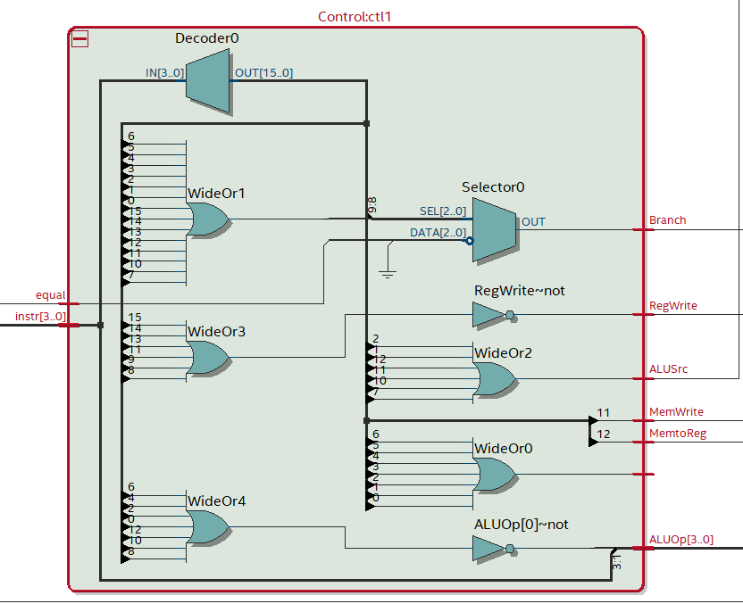
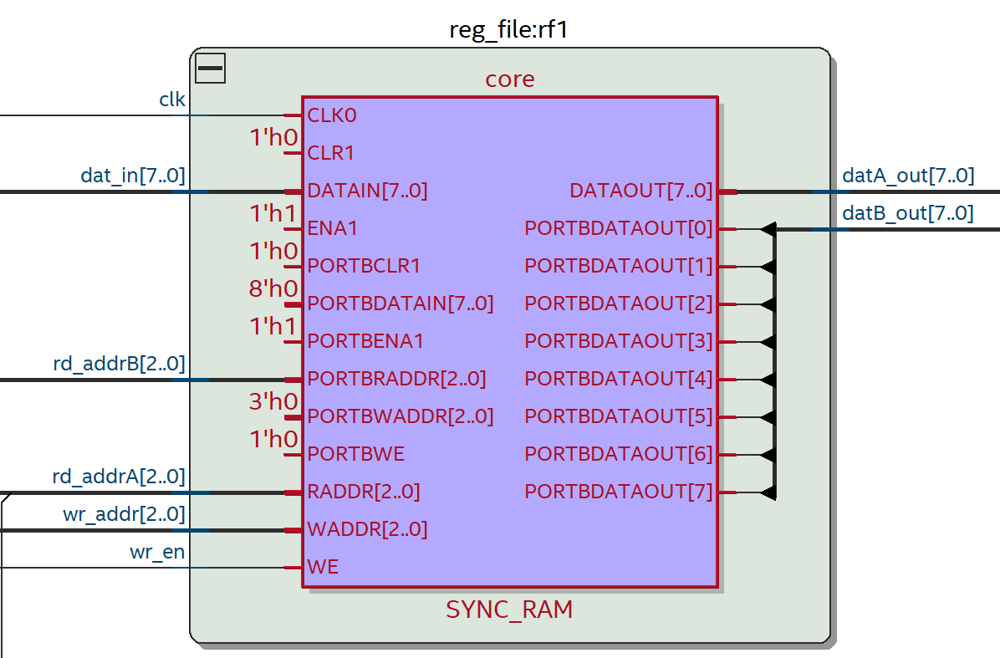
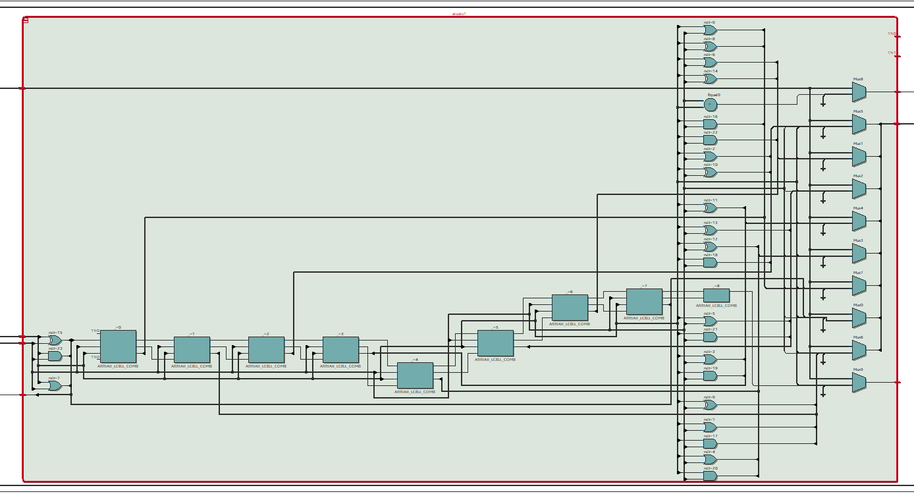
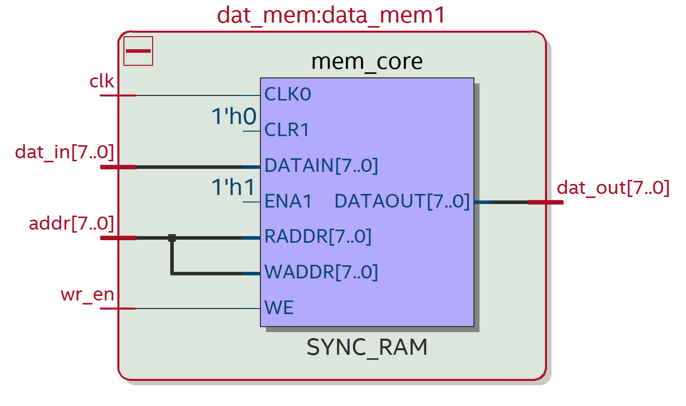
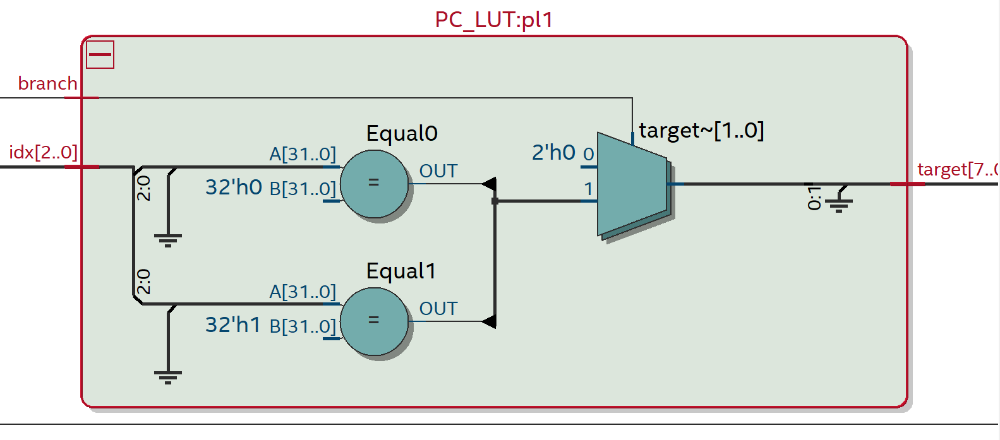

## Authors
- Andrew Park (A17406465)
- Minsang Kim (A17406465)

## Architectural Highlights

### Machine Type
- **ISA Type:** Load-store architecture (LSA – Lightning Speed Architecture)
- **General Features:** Optimized for memory-intensive tasks with a focus on minimizing memory latency through register reuse.

### Registers
- **Total Registers:** 8 general-purpose registers
  - `R0`: Default result register
  - `R1`-`R7`: General-purpose registers
- Emphasis on maximizing register utilization to minimize memory operations.

### Instruction Formats and Bit Breakdowns
The instruction set uses 9-bit instructions with specific formats for different operation types:

| **Type** | **Format**                                | **Corresponding Instructions**               |
|----------|-------------------------------------------|-----------------------------------------------|
| R        | 4 bits opcode, 2 bits reg1, 3 bits reg2   | `add`, `sub`, `srl`, `sll`, `mov`, `or`, `xor`, `and` |
| I        | 4 bits opcode, 2 bits reg1, 3 bits imm    | `addi`, `movi`                                |
| L        | 4 bits opcode, 2 bits reg1, 3 bits reg2   | `lw`                                          |
| S        | 4 bits opcode, 2 bits reg1, 3 bits reg2   | `sw`                                          |
| B        | 4 bits opcode, 2 bits reg1, 3 bits label  | `beq`, `bne`, `cmp`                           |

### Branching Logic
- Two branch instructions: 
  - **`beq`**: Branch if equal
  - **`bne`**: Branch if not equal
- **Addressing Modes:**
  - Direct: Immediate address provided in the instruction.

### Supported Operations

#### Arithmetic and Logical Operations
| **Name** | **Type** | **Description**                              |
|----------|----------|----------------------------------------------|
| `add`    | R        | Adds two registers and stores the result in `R0`. |
| `sll`    | R        | Performs logical left shift.                 |
| `srl`    | R        | Performs logical right shift.                |
| `or`     | R        | Performs bitwise OR operation.               |
| `xor`    | R        | Performs bitwise XOR operation.              |
| `and`    | R        | Performs bitwise AND operation.              |

#### Memory Operations
| **Name** | **Type** | **Description**                              |
|----------|----------|----------------------------------------------|
| `lw`     | L        | Loads a word from memory into a register.    |
| `sw`     | S        | Stores a word from a register into memory.   |

#### Control Flow Operations
| **Name** | **Type** | **Description**                              |
|----------|----------|----------------------------------------------|
| `beq`    | B        | Branch to the given label if equal flag is on.  |
| `bne`    | B        | Branch to the given label if equal flag is off.  |
| `cmp`    | B        | Compares two registers and sets the equal flag. |

#### Immediate Operations
| **Name** | **Type** | **Description**                              |
|----------|----------|----------------------------------------------|
| `addi`   | I        | Adds an immediate value to a register.       |
| `movi`   | I        | Moves an immediate value into a register.    |

## Assembly Code Explanation

### Data Flow
1. **Data Retrieval:**
   - Use `lw` instructions to load data from memory into registers.
2. **Data Manipulation:**
   - Perform arithmetic or logical operations (e.g., `add`, `or`, `sll`).
   - Store intermediate results in `R0` or other general-purpose registers.
3. **Data Storage:**
   - Use `sw` instructions to store results back into memory when necessary.

### Subroutines and Jumps
- **Subroutines:**
  - Frequently executed operations can be modularized using branching instructions (`beq`, `bne`).
- **Control Flow:**
  - Use comparison (`cmp`) followed by conditional branching (`beq`, `bne`) for loops and decision-making.
  - Indirect addressing supports flexibility in program counter manipulation.

### Example
```assembly
movi R1, 1        # Load immediate value 5 into R1
movi R2, 3        # Load immediate value 10 into R2
add R1, R2        # Add R1 and R2, store result in R0
sw R0, [R3]       # Store result from R0 into memory at R3
loop:
bne R1, loop      # Branch back to 'loop' if R1 != R0
```

In this example:
- Immediate values are loaded into registers using `movi`.
- Registers are used for arithmetic operations.
- The `cmp` and `bne` instructions manage the loop flow.
- Memory operations (`sw`) store the computed result back to memory.

## Best Practices
- Minimize memory operations within arithmetic-heavy sections by preloading data into registers.
- Avoid frequent branching as it may cause pipeline stalls.
- Optimize loops with pre-computed indices and avoid runtime memory access during iterations.

## Block Diagram of the Architecture
These are the diagrams of components of the architecture and their connections.

### Top Level



### Program Counter (PC)



The program counter indicates which line of machine code the architecture is reading. The program counter is incremented by 1 after each instruction is executed. However, when there is a branch instruction, the program counter is set to the address of the label.

### Instruction Memory



This component stores all the instructions in machine code. 

### Control Decoder



This component decodes the opcode and generates necessary signals for each operation. When the opcode is `beq`, `bne`, or `cmp`, it generates a signal to set the equal flag.

### Register File



This stores the values of the registers from `r0` to `r7`. 

### Arithmetic Logic Unit (ALU)



We have different cases for each opcodes needed to generate necessary signals for each operations. Furthermore, this component returns an equal flag if the given register is equal to `R0` if the instruction is `cmp`, `beq` or `bne`. 

### Data Memory



The data memory stores the data that is being read or written by the architecture.

### Lookup Table (LUT)



This stores all the labels in binary numbers. 

## Test Benches and Simulation

- `alu_tb.sv` is the test bench for the ALU module. It tests all the operations that the ALU can perform. When test bench is run, it will print out the results of the operations.

**Result**: 
```
# Add: R1=  1, R2=  2, Rslt=  3
# Shift Left: R1=  2, R2=  1, Rslt=  4
# Shift Right: R1=  4, R2=  1, Rslt=  2
# Move A to B: R1= 12, R2=  0, Rslt= 12
# Bitwise OR: R1= 12, R2=  2, Rslt= 14
# Bitwise XOR: R1= 12, R2=  2, Rslt= 14
# Bitwise AND: R1= 12, R2=  2, Rslt=  0
# Add Immediate: R1=  1, R2=  2, Rslt=  3
# Move Immediate: R1=  1, R2=  0, Rslt=  0
# Compare: R1=  1, R2=  1, Equal=1
# No Operation: R1=  1, R2=  0, Rslt=  1
```

- `control_tb.sv` is the test bench for the Control Decoder module. It tests all the opcodes that the Control Decoder can decode. When test bench is run, it will print out the results of the operations.

**Result**: 
```
# ADD: RegDst=1, Branch=0, MemtoReg=0, MemWrite=0, ALUsrc=0, RegWrite=1, ALUOp=0000
# ADD passed
# SLL: RegDst=1, Branch=0, MemtoReg=0, MemWrite=0, ALUsrc=1, RegWrite=1, ALUOp=0001
# SLL passed
# SLR: RegDst=1, Branch=0, MemtoReg=0, MemWrite=0, ALUsrc=1, RegWrite=1, ALUOp=0010
# SLR passed
# MOV: RegDst=1, Branch=0, MemtoReg=0, MemWrite=0, ALUsrc=0, RegWrite=1, ALUOp=0011
# MOV passed
# OR: RegDst=1, Branch=0, MemtoReg=0, MemWrite=0, ALUsrc=0, RegWrite=1, ALUOp=0100
# OR passed
# XOR: RegDst=1, Branch=0, MemtoReg=0, MemWrite=0, ALUsrc=0, RegWrite=1, ALUOp=0101
# XOR passed
# ADD: RegDst=1, Branch=0, MemtoReg=0, MemWrite=0, ALUsrc=0, RegWrite=1, ALUOp=0110
# ADD passed
# ADDi: RegDst=0, Branch=0, MemtoReg=0, MemWrite=0, ALUsrc=1, RegWrite=1, ALUOp=0111
# ADDi passed
# BNE: RegDst=0, Branch=0, MemtoReg=0, MemWrite=0, ALUsrc=0, RegWrite=0, ALUOp=1000
# BNE passed
# BNE: RegDst=0, Branch=1, MemtoReg=0, MemWrite=0, ALUsrc=0, RegWrite=0, ALUOp=1000
# BNE passed
# BEQ: RegDst=0, Branch=1, MemtoReg=0, MemWrite=0, ALUsrc=0, RegWrite=0, ALUOp=1001
# BEQ passed
# BEQ: RegDst=0, Branch=0, MemtoReg=0, MemWrite=0, ALUsrc=0, RegWrite=0, ALUOp=1001
# BEQ passed
# MOVi: RegDst=0, Branch=0, MemtoReg=0, MemWrite=0, ALUsrc=1, RegWrite=1, ALUOp=1010
# MOVi passed
# SW: RegDst=0, Branch=0, MemtoReg=0, MemWrite=1, ALUsrc=1, RegWrite=0, ALUOp=1011
# SW passed
# LW: RegDst=0, Branch=0, MemtoReg=1, MemWrite=0, ALUsrc=1, RegWrite=1, ALUOp=1100
# LW passed
# NOP: RegDst=0, Branch=0, MemtoReg=0, MemWrite=0, ALUsrc=0, RegWrite=0, ALUOp=1111
# NOP passed
```

- `int2flt_tb_noround.sv` is the test bench for the Integer to Floating Point module. It tests the conversion of integer to floating point without rounding. When test bench is run, it will print out the results of the conversion.
- `top_level_tb.sv` is the test bench for the top level module. It tests the overall functionality of the architecture. When test bench is run, it will print out the results of the operations. This test bench reads the instructions from `machine_code.txt`. 
